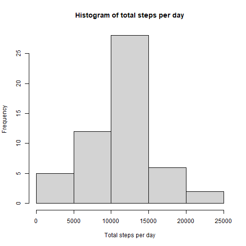
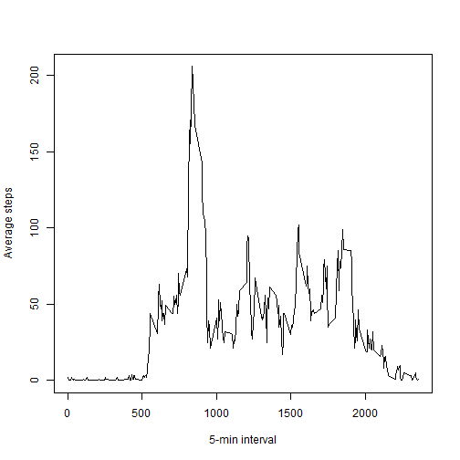
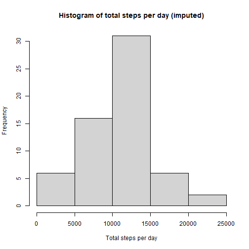
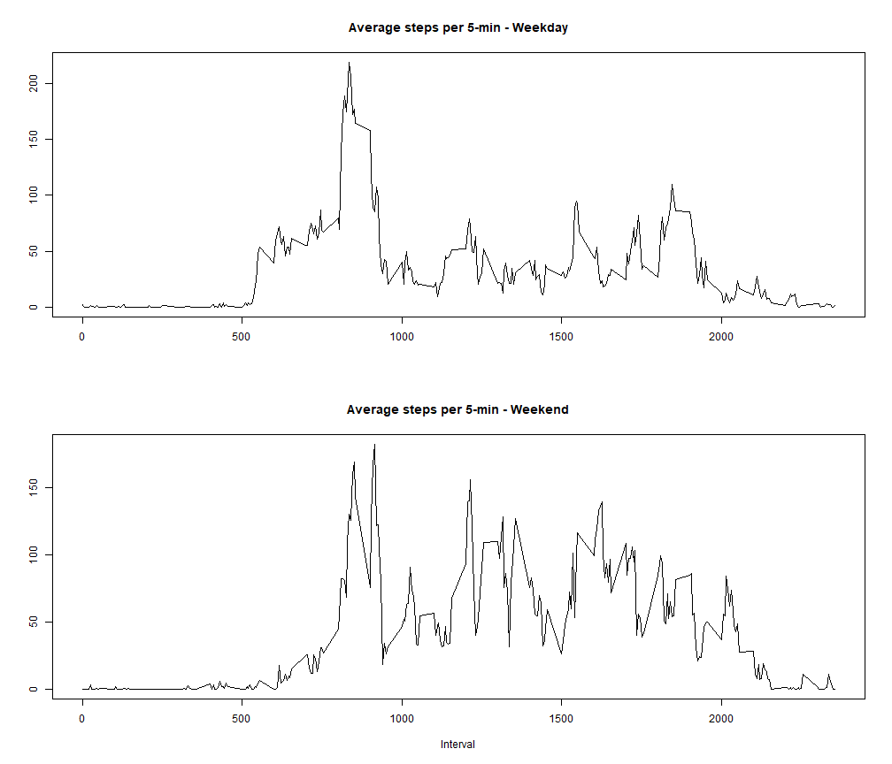

# Assignment for Reproducable Research - Week 2

Packages are loaded

## Loading and preprocessing the data

### 1. Load the data

```r
activity_monitoring_data <- read.csv(unzip("activity.zip"))
```

### 2. Process/transform the data (if necessary) into a format suitable for your analysis
Date and date-time variable is created

```r
activity_monitoring_data$date <- as.Date(activity_monitoring_data$date)
activity_monitoring_data$hour <- floor(activity_monitoring_data$interval / 60)
activity_monitoring_data$minute <- activity_monitoring_data$interval - floor(activity_monitoring_data$interval / 60)*60
```

## What is mean total number of steps taken per day?
#### 1. Make a histogram of the total number of steps taken each day


```r
steps_per_day <- activity_monitoring_data %>% 
                    group_by(date) %>%
                    summarise(total_steps_per_day = sum(steps))

hist(steps_per_day$total_steps_per_day,
     xlab = "Total steps per day",
     ylab = "Frequency",
     main = "Histogram of total steps per day")
```



#### 2. Calculate and report the mean and median total number of steps taken per day


```r
options(scipen=999) #remove scientific notation
mean_total_steps_per_day <- round(mean(steps_per_day$total_steps_per_day, na.rm = TRUE), digits = 0)
median_total_steps_per_day <- round(median(steps_per_day$total_steps_per_day, na.rm = TRUE), digits = 0)
## Including Plots
```

Mean total steps per day is 10766 and median total steps is 10765

## What is the average daily activity pattern?

#### 1. Make a time series plot (i.e. type = "l") of the 5-minute interval (x-axis) and the average number of steps taken, averaged across all days (y-axis)


```r
average_steps_per_5_min <- activity_monitoring_data %>%
                            group_by(interval) %>%
                            summarise(average_steps_per_5_min = round(mean(steps, na.rm = TRUE), digits = 0))

plot(average_steps_per_5_min$interval, average_steps_per_5_min$average_steps_per_5_min,
     type = "l",
     xlab = "5-min interval",
     ylab = "Average steps")
```



#### 2. Which 5-minute interval, on average across all the days in the dataset, contains the maximum number of steps?

```r
max_interval <- average_steps_per_5_min$interval[which(average_steps_per_5_min$average_steps_per_5_min == max(average_steps_per_5_min$average_steps_per_5_min, na.rm  =TRUE))] 
```

The interval with the highest number of average steps is named 835

## Imputing missing values

#### 1. Calculate and report the total number of missing values in the dataset (i.e. the total number of rows with NAs)

```r
missing_values <- sum(is.na(activity_monitoring_data$steps))
```

There are 2304 missing values in the dataset

#### 2. Devise a strategy for filling in all of the missing values in the dataset. The strategy does not need to be sophisticated. For example, you could use the mean/median for that day, or the mean for that 5-minute interval, etc.

To fill in the missing values in the variable steps a shortcut is used. The package missRanger which imputes missing values through a random forest algorithem is used. This provides results in a speedy manner without spending too much time evaluating the imputation.

#### 3. Create a new dataset that is equal to the original dataset but with the missing data filled in.


```r
library(missRanger)
activity_monitoring_dataImputed <- missRanger(activity_monitoring_data, num.trees = 100)
```

```
## 
## Missing value imputation by random forests
## 
##   Variables to impute:		steps
##   Variables used to impute:	steps, date, interval, hour, minute
## iter 1:	.
## iter 2:	.
## iter 3:	.
```

The dataset 'activity_monitoring_data_Imputed' contains imputed values

#### 4. Make a histogram of the total number of steps taken each day and Calculate and report the mean and median total number of steps taken per day. Do these values differ from the estimates from the first part of the assignment? What is the impact of imputing missing data on the estimates of the total daily number of steps?


```r
steps_per_day_imputed <- activity_monitoring_dataImputed %>% 
                    group_by(date) %>%
                    summarise(total_steps_per_day = sum(steps))

hist(steps_per_day_imputed$total_steps_per_day,
     xlab = "Total steps per day",
     ylab = "Frequency",
     main = "Histogram of total steps per day (imputed)")
```



The mean and median is calculated


```r
options(scipen=999) #remove scientific notation
mean_total_steps_per_day_imputed <- round(mean(steps_per_day_imputed$total_steps_per_day), digits = 0)
median_total_steps_per_day_imputed <- round(median(steps_per_day_imputed$total_steps_per_day), digits = 0)
## Including Plots
```

After imputation mean total steps per day is 10482 and median total steps is 10600

There is a slight deviation in the mean and median after imputation. After imputation the mean differs with 284 and the median differs with 165

## Are there differences in activity patterns between weekdays and weekends?

#### 1. Create a new factor variable in the dataset with two levels -- "weekday" and "weekend" indicating whether a given date is a weekday or weekend day.


```r
activity_monitoring_dataImputed$weekday <- lubridate::wday(activity_monitoring_dataImputed$date)
activity_monitoring_dataImputed$weekend_or_weekday[activity_monitoring_dataImputed$weekday %in% c(1, 7)] <- "weekend"
activity_monitoring_dataImputed$weekend_or_weekday[activity_monitoring_dataImputed$weekday %in% c(2,3, 4,5, 6)] <- "weekday"
```

#### 2. Make a panel plot containing a time series plot (i.e. type = "l") of the 5-minute interval (x-axis) and the average number of steps taken, averaged across all weekday days or weekend days (y-axis). The plot should look something like the following, which was created using simulated data:


```r
steps_per_interval_WW <- activity_monitoring_dataImputed %>%
    group_by(weekend_or_weekday, interval) %>%
    summarize(average_steps_per_day=mean(steps))
```

```
## `summarise()` has grouped output by 'weekend_or_weekday'. You can override using the `.groups` argument.
```

```r
steps_per_interval_Weekday <- dplyr::filter(steps_per_interval_WW, weekend_or_weekday == "weekday")
steps_per_interval_Weekend <- dplyr::filter(steps_per_interval_WW, weekend_or_weekday == "weekend")
```


```r
par(mfrow=c(2,1))

with(steps_per_interval_Weekday, plot(interval, average_steps_per_day, type = "l", main = "Average steps per 5-min - Weekday", xlab = "", ylab = ""))
with(steps_per_interval_Weekend, plot(interval, average_steps_per_day, type = "l", main = "Average steps per 5-min - Weekend", xlab = "Interval", ylab = ""))
```


